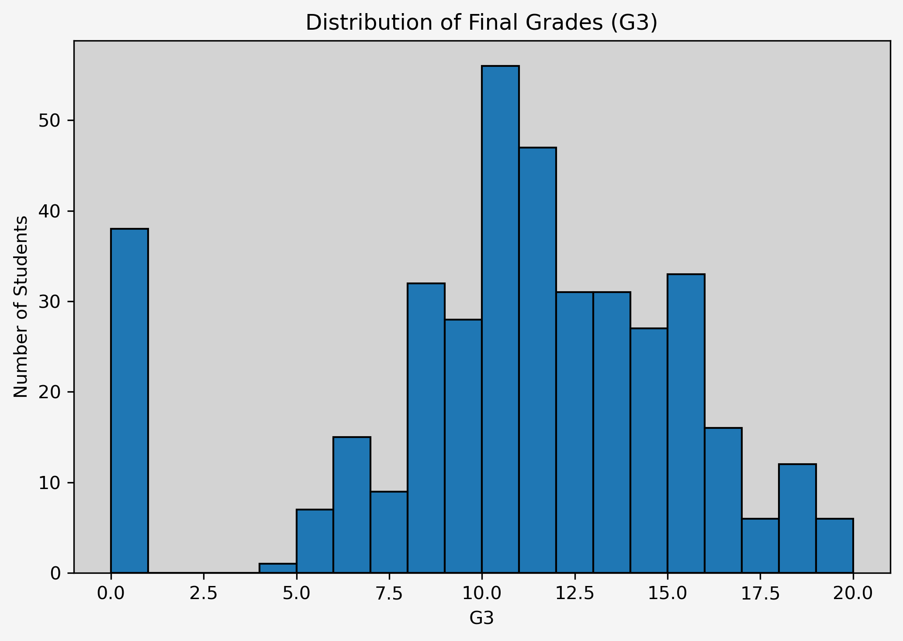
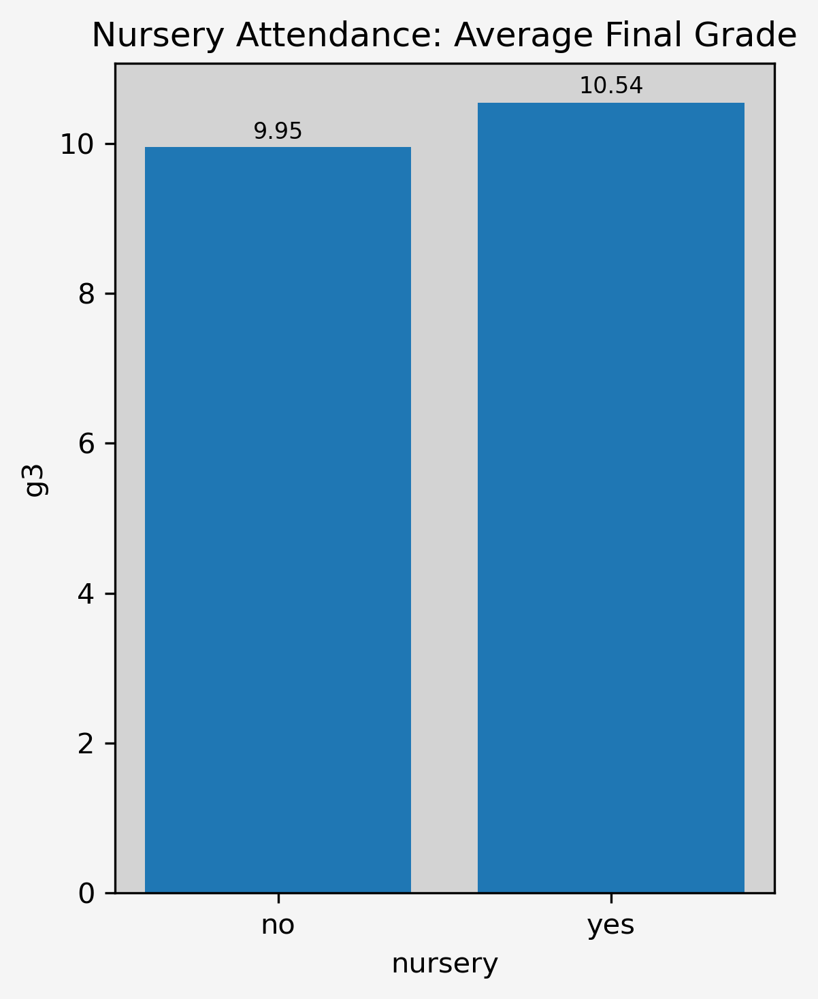
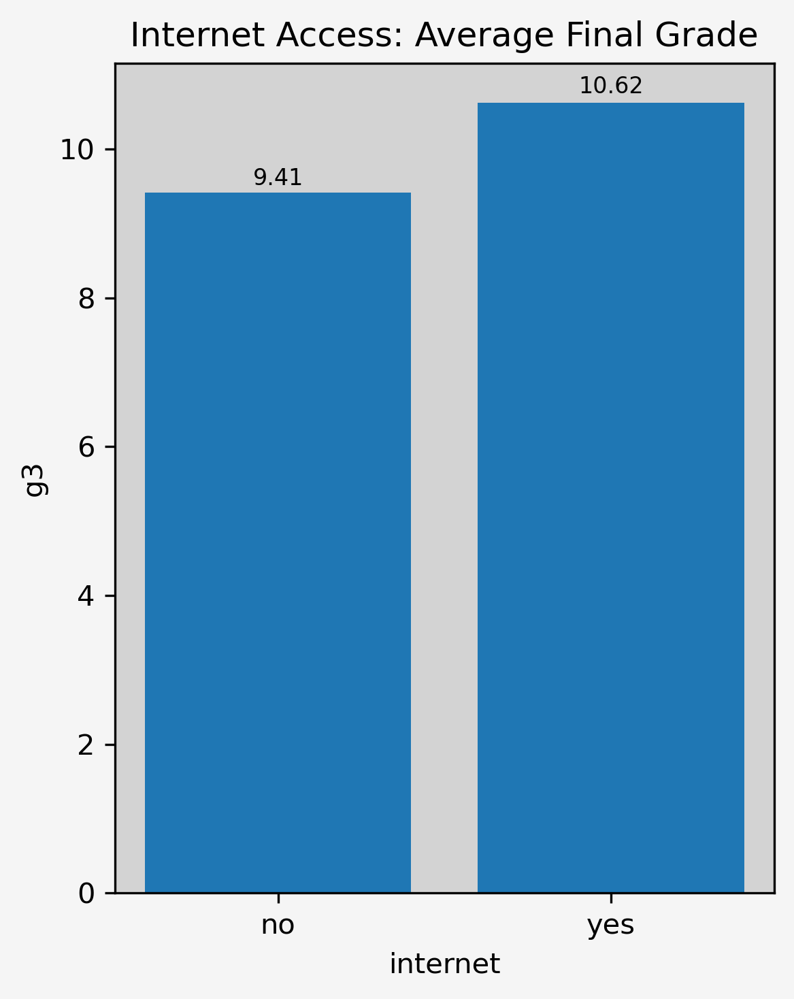
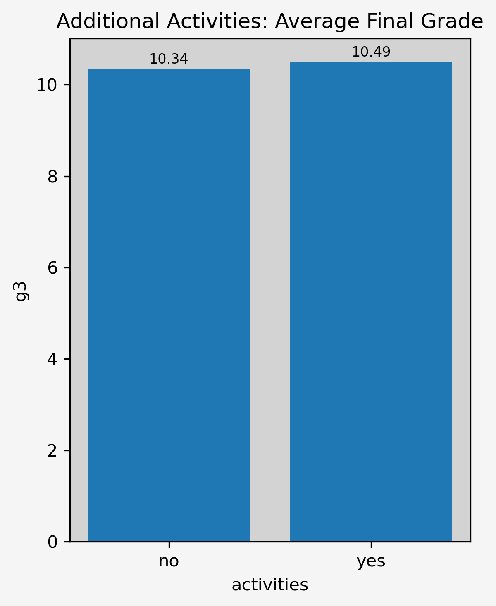
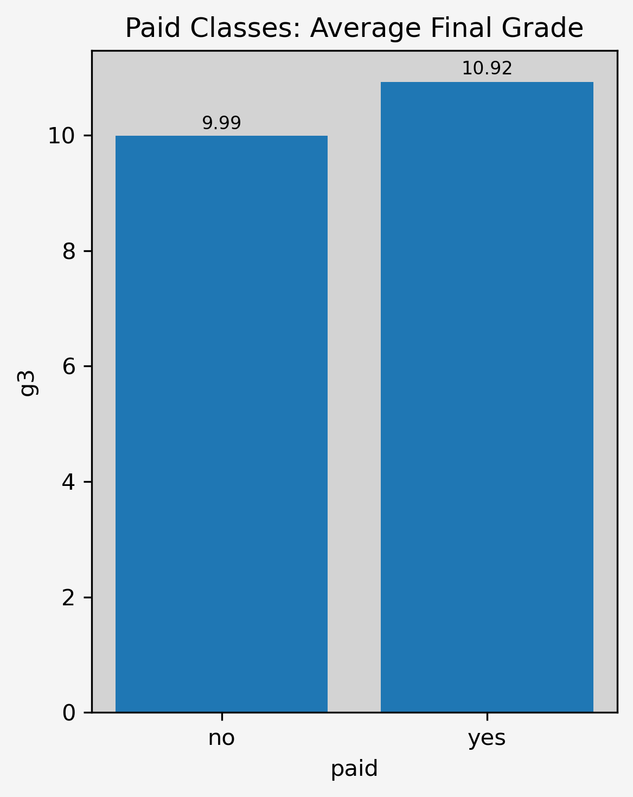
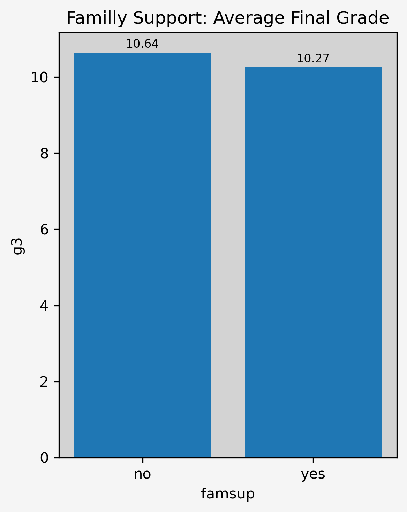

# Parents' Circle of Influence

## Current Development 

The project now includes a SQL-based analysis module located in `sql_analysis/`, which reproduces the key COI analyses using database queries.
The next step is integrating the SQLite database with the Python workflow so that analyses can be performed directly on SQL-prepared data.

## 1. Project Overview

**Goal:** To identify which parental factors fall within the "Circle of Influence" and may influence their children's school performance.

**Context:** The Circle of Influence, introduced by Stephen Covey (*7 Habits of Highly Effective People*), focuses on factors fully under one's control. By isolating these variables within the dataset, this analysis aims to highlight actionable areas where parents can have a direct and meaningful impact on their child's learning outcomes.

## 2. Dataset Description

**\- Name:** Student Alcohol Consumption

**\- Source**: [Kaggle – Student Alcohol Consumption](https://www.kaggle.com/datasets/uciml/student-alcohol-consumption)

**\- Size:** 395 rows, 33 columns

### Key Variable Analyzed

**Student grades**

**\- G1, G2:** period grades

**\- G3:** final grade

**Student information**

**\- sex:** gender

**\- address:** urban or rural

**\- romantic:** relationship status

**\- studytime**: weekly study time

**Circle of Influence**

These variables were selected because they represent factors fully controlled by parents and therefore align with Covey's Circle of Influence framework:

**\- guardian**: student's guardian (mother/father/other)

**\- famsup**: family educational support

**\- paid**: extra paid classes

**\- activities**: extra-curricular activities

**\- nursery**: attended nursery school

**\- internet**: Internet access at home

## 3. Tools \& Technologies

**Language:** Python, SQL

**Database:** SQLite

**Python Libraries:** Pandas, Matplotlib

**Environment:** Jupyter Notebook, DBeaver

## 4. Key Goals \& Insight

**Project Goals**

\- Identify which 'Circle of Influence' variables correlate most strongly with student performance.

\- Evaluate how each COI factor influences the average final grade (G3).

\- Provide simple and clear analysis that parents can easily understand and apply.

**Key Insight \& Findings**

**\- Nursery Attendance:** Students who attended nursery show higher average grades compared to those who didn't.

**\- Internet Access:** Internet access at home is associated with higher performance.

**\- Extracurricular Activities:** both paid classes and extra activities show a positive trend toward higher grades.

**\- Family Support:** Students who report receiving additional family support show lower average grades.

**\- Guardian Type:** Students whose guardian is neither mother nor father score lower than those under parental guardianship.

## 5. Methodology \& Analysis Process

**5.1 Data Cleaning and Preparation**

Before starting the analysis, the dataset was checked for common data quality issues.

This included:

\- verifying the presence of duplicate rows,

\- checking for missing values across all columns.

The validation was performed in both the Python and SQL analysis  to ensure consistency across the two approaches.

**Result:** The dataset contained no duplicates and no missing values, so no additional cleaning steps were required at this stage.

**5.2 Feature Engineering \& Transformation**

The dataset preparation is divided into two stages: SQL-based feature selection and Python-based transformations.

**SQL analytical view**

&nbsp;   A dedicated SQL view (*coi*) was created to isolate the Circle of Influence features (guardian, nursery, famsup, paid, activities, internet) together with the target variable (G3).
This view acts as a reproducible analytical dataset used for aggregation and comparison queries.

**Column name formatting**

&nbsp;   All column names were converted to lowercase, stripped of extra spaces, and formatted using underscores for consistency.

**Feature grouping**

&nbsp;   All features were grouped into logical segments (Circle of Influence, Family \& Environment, Time-Related Factors, Other Factors) to structure the analysis.

**Guardian variable encoding**

&nbsp;   The original *'guardian'* column contained three categories (mother, father, other) and was therefore unsuitable for correlation. It was transformed into three dummy variables, which were added to the dataset, and the original column was removed from the COI group.

**Target DataFrame for ML analysis**

&nbsp;   A separate copy of the dataset *(df\_ml)* was created for numeric processing and correlation analysis.

**Binary variable conversion**

&nbsp;   All yes/no variables in the COI group were mapped to numeric values (1/0) to ensure compatibility with statistical and machine-learning methods.

**5.3 Distribution of Final Grades (G3)**

To understand the overall performance of students, descriptive statistics were calculated for the target variable 'G3' (Final Grade, scale 0-20).

**Descriptive Statistics**

**Mean:** 10.42 | **Median:** 11.0 - Indicates a balanced, near-normal distribution

**Spread:** Standard Deviation of 4.58 highlights a significant performance gap.

**Range:** 0 to 20.

**Outliers:** A noticeable cluster of students scored '0'. These values were kept, as failing a course is an important outcome when evaluating parental influence.

**Visualization**

<p align="center">
  
</p>

A histogram of the final grades shows:

\- a moderate spread across 0-20 scale

\- a concentration around the middle range

\- a visible spike at 0

**5.4 Circle of Influence Analysis**

This section examines individual parental factors to see how strongly they relate to student performance.

**Nursery Attendance (Early Education)**

<p align="center">
  
</p>

\- **Correlation with 'G3':** **0.05** (Very Weak Positive).

\- **Mean difference (yes-no):** **+0.59** points

\- **Insight:** While there is a positive link, early childhood education has a minimal direct impact on high school performance compared to current factors.

**Internet Access (Home Resources)**

<p align="center">
  
</p>

\- **Correlation with 'G3':** **0.10** (Very Weak Positive)

\- **Mean Difference (yes – no):** **+1.21** points

\- **Insight:** Internet access appears to support better learning conditions, likely by improving access to study materials, research, and homework tools.

**Activities (Extra-Curricular Engagement)**

<p align="center">
  
</p>

\- **Correlation with 'G3':** **0.02** *(Very Weak Positive)*

\- **Mean Difference (yes – no): +0.02** points

\- **Insight:** The effect is negligible. While activities may provide developmental benefits, they show almost no measurable impact on academic performance in this dataset.

**Paid Classes (Extra Lessons)**

<p align="center">
  
</p>

\- **Correlation with G3:** **0.10** (Very weak positive)

\- **Mean Difference (yes-no):** **+0.93** points

\- **Insight:** Paid classes show a small but clearer positive association with final grades compared to other COI factors. While the effect is not strong, structured additional lessons appear to support slightly better performance.

**Family Support**

<p align="center">
  
</p>

\- **Correlation with G3:** **–0.04** (Very Weak Negative)

\- **Mean Difference (yes-no):** **-0.37** points

\- **Insight:** The effect is minimal and statistically weak. Family support — as defined in the dataset — does **not** show a meaningful positive influence on final grades.

**Guardians**

<p align="center">
  
</p>

\- **Correlation with G3**   

&nbsp;   **Mother:** **0.02** (Very Weak Positive)
   
&nbsp;   **Father:** **0.03** (Very Weak Positive)

&nbsp;   **Other:** **-0.09** (Very Weak Positive)   

\- **Mean Difference (yes - no)** 

&nbsp;   **Mother:** **+0.22** points 

&nbsp;   **Father:** **+0.36** points  

&nbsp;   **Other:** **-1.47 points**
  

\- **Insight:**  Students cared for by *mother* or *father* perform similarly well, with almost no difference in average grades. However, students whose primary guardian is listed as *other* score notably lower (–1.47), indicating a potential disadvantage.

## 6. Key Findings

**Summary of Impact**

&nbsp;   The six "Circle of Influence" factors showed only small differences in average grades. There is no single action that dramatically improves performance on its own.

**Positive Drivers**

&nbsp;   The most consistent positive effects came from providing internet access, paid classes, and early nursery education, though individual gains were marginal.

**Risk Factors**

&nbsp;   Students cared for by a guardian other than a parent scored noticeably lower, indicating a potential disadvantage.

**Conclusion**

&nbsp;   There is no one big fix—but small positive habits add up. Stable support, involvement, and access to learning resources can create an environment where students perform better over time.

## 7. Project Structure

```text
student-performance-analysis/
├── README.md
├── requirements.txt
│
├── data/
│   └── student.csv
│
├── python_analysis/
│   ├── coi_analysis.ipynb
│   └── charts/
│       ├── g3_distribution.png
│       ├── nursery.png
│       ├── internet.png
│       ├── activities.png
│       ├── paid.png
│       ├── famsup.png
│       ├── guardian_mother.png
│       ├── guardian_father.png
│       ├── guardian_other.png
│       ├── guardians.png
│
└── sql_analysis/
    ├── db/
    └── coi_analysis.sql
```
## 8. How to Run This Project

This project contains two analysis layers: Python-based analysis and SQL-based analysis.

### Python Analysis (Jupyter Notebook)

**Requirements**

\- Python **3.10+** (recommended)

\- Required libraries listed in **requirements.txt**

**Steps**

**1\. Clone the repository**

&nbsp;   git clone <https://github.com/michal-ry/student-performance-analysis.git>
   
**2\. Navigate to the project directory** 

&nbsp;   cd parents-circle-of-influence

**3\. Install dependencies**
 
&nbsp;   pip install -r requirements.txt  

**4\. Launch Jupyter Notebook**   

&nbsp;   jupyter notebook 

**5\. Open** `python_analysis/coi_analysis.ipynb` 

&nbsp;   Run the cells from top to bottom.

All charts are automatically saved to the `python_analysis/charts/` directory.

### SQL Analysis (SQLite)

The SQL module reproduces key parts of the analysis using database queries.

**Steps**

**1\.** Open DBeaver (or any SQLite-compatible client)

**2\.** Create a new SQLite connection

**3\.** Select database file: `sql_analysis/db/student.db`

**4\.** Import dataset: `data/student.csv` into table named `student`

**5\.** Open `sql_analysis/coi_analysis.sql`

**6\.** Execute the script from top to bottom

The script will:<br>
&nbsp;   \- validate data quality<br>
&nbsp;   \- create the `coi` analytical view<br>
&nbsp;   \- compute descriptive statistics<br>
&nbsp;   \- calculate COI feature comparisons

## 9. Future Work

Possible future updates:

**\- SQL-Python integration**

&nbsp;   Load analytical views from the SQLite database directly into Python to build a unified data pipeline (SQL for data preparation, Python for analysis and visualization).


**\- Regression analysis** 

&nbsp;   Apply statistical regression techniques both for COI-only and full-feature scenarios to quantify relationships and interpret variable effects.  

**\- Machine Learning model**  

&nbsp;   Train a predictive model (e.g., linear regression or tree-based models) to estimate final grades (G3) using all features (prediction focus).